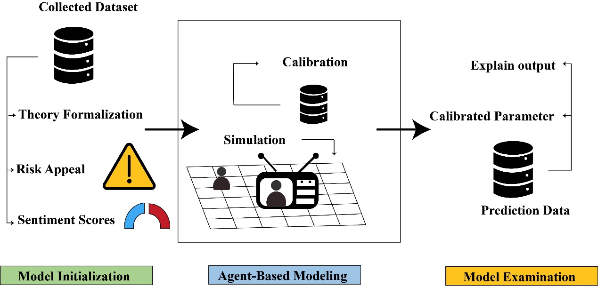

# CSDAG
This repository contains the code and data for the paper *"Dynamic Connectivity of Multi-Arousal Sentiment and Feedback Loops based on Complex Network Analysis"*.

- **ABM.ipynb**: Implements the agent-based model (ABM) used in the paper, detailing the computational processes outlined in the manuscript.
- **Text_mining.ipynb**: Contains code for text processing and sentiment analysis.
- **Prediction.ipynb**: Includes the training and prediction code for modeling the transitions in node states.
- **Plot.ipynb**: Provides code for visualizing the results of the model simulations.

### Key Figures:

1. **CSDAG Framework**  
   Our proposed framework for health communication models various groups of agents on multi-layer networks.  
   

2. **Network Evolution**  
   The simulation results show the evolution of node states over time.  
   

3. **Model Performance**  
   The method effectively captures the temporal dynamics of node states.  
   - Sentiment and metric trends:  
     
   - Media metrics and risk assessment:  
     
   - Parameter distribution with mean and 3SE bars:  
     
   - Fine-tuned accuracy for three tasks:
     
   - Overview of Research Methodology:
          