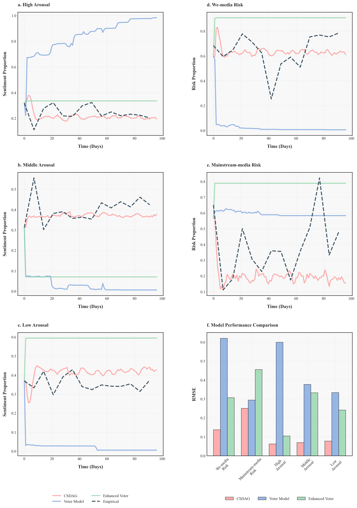
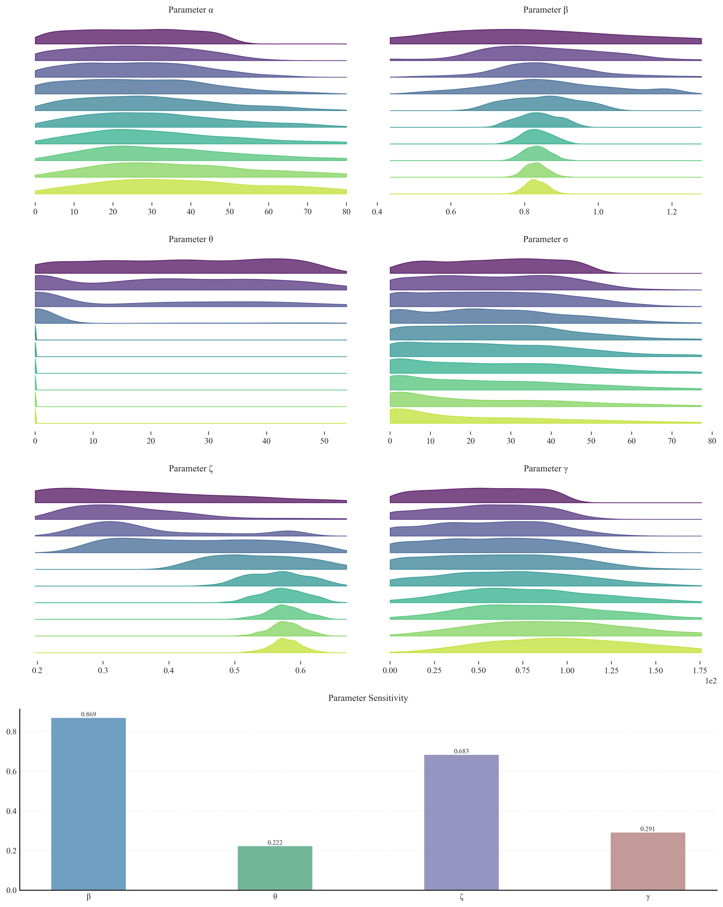
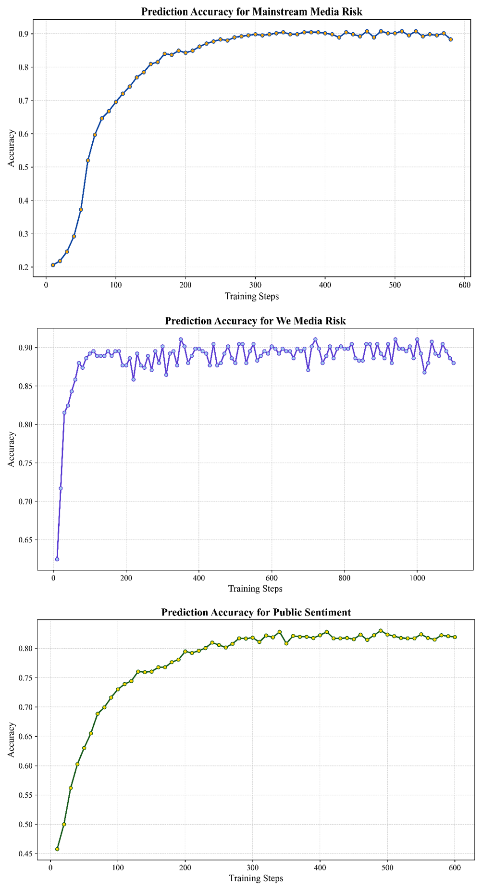

# CSDAG: Complex Systems Dynamics in Health Communication

This repository presents a comprehensive framework for analyzing the dynamic interplay between public sentiment and information flows in Long-COVID discourse. Our work introduces a novel computational approach that integrates multi-layer network analysis with agent-based modeling to understand the complex dynamics of health communication.

The framework, implemented on a high-performance computing infrastructure with dual RTX4090 GPUs, encompasses several interconnected components that systematically address the theoretical and empirical aspects of health communication dynamics:

### Core Components

The repository's architecture reflects the methodological progression from empirical analysis to theoretical modeling:

- **Text_mining**: Implements advanced natural language processing techniques for sentiment extraction and discourse analysis
- **Network_analysis**: Examines the topological properties and evolutionary patterns of communication networks
- **ABM**: Develops a sophisticated agent-based model that captures the emergent behaviors in health communication
- **Prediction**: Employs machine learning approaches to model state transitions and information cascades
- **Counterfactual**: Conducts rigorous causal inference through systematic mechanism removal
- **Baseline**: Implements comparative analyses against established models, including the voter model

### Methodological Framework

Our approach synthesizes empirical observations with theoretical modeling through a series of interconnected analyses, visualized in the accompanying figures:

1. **CSDAG Framework**  
   The multi-layer network architecture models the complex interactions between diverse agent groups, capturing both vertical and horizontal information flows.
   

2. **Network Evolution**  
   Temporal dynamics of node states reveal emergent patterns in health communication networks.
   

3. **Validation and Performance**  
   Rigorous validation demonstrates the framework's predictive power:
   - Empirical validation through information flow analysis:  
     
   - Quantitative assessment of media impact and risk metrics:  
     
   - Statistical robustness through parameter distribution analysis:  
     
   - Task-specific performance metrics:
     
   - Methodological overview:
     

This framework provides a robust foundation for understanding the complex dynamics of health communication, with implications for public health policy and intervention design.